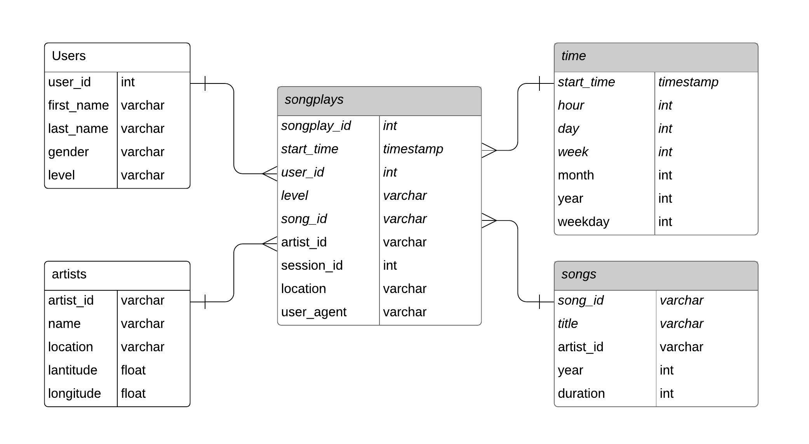

## Introduction
***
A startup called Sparkify wants to analyze the data they've been collecting on songs and user activity on their new music streaming app. The analytics team is particularly interested in understanding what songs users are listening to. Currently, they don't have an easy way to query their data, which resides in a directory of JSON logs on user activity on the app, as well as a directory with JSON metadata on the songs in their app.

They'd like to create a database (Preferably by  Postgres) with tables designed to optimize queries on song play analysis. Best Practice for them is to create a database schema and ETL pipeline for this analysis. As data and dataflow accuracy and quality database and ETL pipeline should be tested by running queries given by the analytics team from Sparkify and results compare with their expected results.

## Project Description
***

In this project first define fact and dimension tables for a star schema for a particular analytic focus, and write an ETL pipeline that transfers data from files in two local directories into these tables in Postgres using Python and SQL. In project use these last version package: numpy, pandas and psycopg2.

### Project structure

Project structures contain two and five files, based on following description:
1. **data** - folder, Source of the JSON file, all these files have to be elaborated
    - **log_data** - A folder that contains files of log files in JSON format generated by an event simulator based on the songs in the dataset above. These simulate app activity logs from a music streaming app based on specified configurations.
    - **song_data** - Each file is in JSON format and contains metadata about a song and the artist of that song. The files are partitioned by the first three letters of each song's track ID
2. **image** - folder, use to orgnize images use in README file
3. **`etl.ipynb`** - file, reads and processes a single file from `song_data` and `log_data` and loads the data into tables. This notebook contains detailed instructions on the ETL process for each of the tables.
4. **`test.ipynb`** - file, a notebook that helps to know if tables are created and data are ingested correctly
5. **`create_tables.py`** - file, This script will drop old tables (if exist) ad re-create new tables
6. **`etl.py`** - file, This script read all JSON files in `data` folder and load extracted data in related tables
7. **`sql_queries.py`** - file, This file contains variables with SQL statement in String formats,partitioned by CREATE, DROP, INSERT statements plus a FIND query

## Data Model
***

Following schema shows data model for Sparkify data. As shown in trhe model, it has one "Fact Table" and four "Dimentional Tables". 
The relation type between dimentional tables and fact table are one to many.

    

    
### Fact Table
1. **songplays** - records in log data associated with song plays i.e. records with page NextSong
    - *songplay_id, start_time, user_id, level, song_id, artist_id, session_id, location, user_agent*

### Dimension Tables
2. **users** - users in the app
    - *user_id, first_name, last_name, gender, level*
3. **songs** - songs in music database
    - *song_id, title, artist_id, year, duration*
4. **artists** - artists in music database
    - *artist_id, name, location, latitude, longitude*
5. **time** - timestamps of records in songplays broken down into specific units
    - *start_time, hour, day, week, month, year, weekday*

## How to Run

A PostgreSQL instance up and running is needed. [The last version](https://www.postgresql.org/download/) can be find [here](https://www.postgresql.org/download/). Indeed, python and some it's package (Pandas, NumPy and psycopg2 as wrapper for PostgreSQL in python) 

After installing instance and creating user paswoord as `student`, run `create_table.py` by this command:

> `python create_table.py`

This will create our tables, this must be runned first 

and the making pipelines by this order:

>`python etl.py`

this will execute our ETL process and extract and load data.

